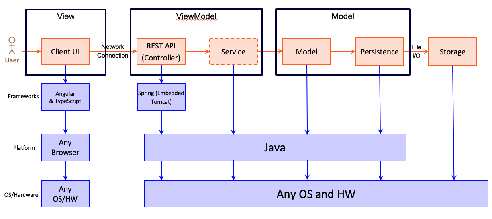

# PROJECT Design Documentation

## Team Information
* Team name: 8h-8ball
* Team members
  * Aadith Charugundla
  * Cullen Walsh
  * Jessica Phillips
  * Zachary Rutherford
  * Frank Andes

## Executive Summary

### Purpose

This project will an e-store website to allow a small business owner to sell products to consumers.  This specific e-store will feature a varitiey of coffee and tea blends to be sold to customers.  The e-store will allow the manage inventory and add, modify, or remove products to be sold, while the customer will be able to browse the products and purchase them through the e-store.  

### Glossary and Acronyms

| Term | Definition |
|------|------------|
| SPA | Single Page |
| HTML | Hypertext Markup Language |
| MVP | Minimal Viable Product |
| MVVM | Model-View-ViewModel |
| CSS | Cascading Style Sheets | 
| REST API | Representational State Transfer Application Programming Interface | 
| HW | Hardware |
| OO | Object-Oriented |
| OS | Operating System |

## Requirements

Features of the application include browsing products, purchasing tea or coffee, adding products to a cart and proceeding to checkout, selecting custom packaging, inventory management, admin managment, and managing customer orders.  

### Definition of MVP

The MVP includes minimal authentication, which includes customer and admin user accounts for logging in and out of the site.  As well as customer and e-store admin fuctionality. The required functionality involves searching for products, selecting the size of a product, modifying personal information, and addind or removing products from the cart, for customers.  The admin aspect of the functionality involves adding, removing, and editing product and ingredient data, and adding or removing other admins.  Admins will not have access to a shopping cart like a customer would.  

### MVP Features
>  _**[Sprint 4]** Provide a list of top-level Epics and/or Stories of the MVP._

* Prepackaged Tea/Coffee
* Customer Orders
* Single Cart
* Checkout
* Remove Products
* Modify Products
* Add Products
* Browse Products
* Add Admins
* Remove Admins
* Manage Ingredients
* User Login/Register
* Modify User

### Enhancements
> _**[Sprint 4]** Describe what enhancements you have implemented for the project._

* Gift Wrapping
* Package Picture
* Personalized Card
* Custom Blend
* Multiple Addresses
* Modify Admin Priviledges

## Application Domain

This section describes the application domain.

> _**[Sprint 2 & 4]** Provide a high-level overview of the domain for this application. You
> can discuss the more important domain entities and their relationship
> to each other._

## Architecture and Design

> _This section describes the application architecture._

### Summary

The following Tiers/Layers model shows a high-level view of the webapp's architecture.

The e-store web application, is built using the Model–View–ViewModel (MVVM) architecture pattern. 

The Model stores the application data objects including any functionality to provide persistance. 

The View is the client-side SPA built with Angular utilizing HTML, CSS and TypeScript. The ViewModel provides RESTful APIs to the client (View) as well as any logic required to manipulate the data objects from the Model.

Both the ViewModel and Model are built using Java and Spring Framework. Details of the components within these tiers are supplied below.

### Overview of User Interface

The very top left of our webpage displays the text "Coffee/Tea E-store" and is prevalent on all the pages. Right underneath this text are the buttons "Back" and "Logout", since we believed these to be the most important. This notion is reflected in almost all websites and browsers. Notice that Chrome for example has the back arrow on the top left of the window. In the same row but on the far right, we have the "Settings" button, which brings the user to the user settings component. We belived that this also belonged near the top because one of the first things a new user would have to do is change their personal information by adding a credit card number, address, etc. A bit below that on the next row, we have the "Home", Dashboard", and "Store" buttons next to each other. The home button naturally takes the user to the homepage which is currently empty, but will later have more information on it. The Dashboard button brings the user to the dashboard where they can see a list of top products as well as search for products. The Store button leads to the main store which displays a table whose columns are Name, Blend Type, Ingredients, and Price. Right above this table is a search bar which can be used to search for individual products. The user also has the option to sort products by increasing or decreasing alphabetical order by clicking on the "Name" column. Once the user clicks on a product they are taken to a separate compoent which shows the details of the product such as the name, blend, sizes, price, and ingredients. The user has a choice when it comes to what size they want (from the options available since some sizes might not have enough ingredients to make) and once they've picked one they can click add to cart, which opens the cart on the side of the screen. This has a close button, as well as the option to remove items from the cart. Once the user is done creating their cart, they can click the Checkout button which takes them to the checkout component. Here they can see the products they have in their cart, as well as the address and payment method. When they are ready, they can click Order and will be brought back to the home page with an empty cart. If the user clicks logout they are taken back to the login page where they are prompted to input a username and password before clicking Login. If they wish, they can also register as a new user. If the user signs in as an administrator, they will see that they do not have access to the cart and instead have the ability to manage the store by managing the products (creating/deleting/modifying) as well as managing the ingredients (creating/deleting/modifying). They also have the option to view the current admins and add/remove other admins. In the orders page you can see a list of user orders that need to be completed, and if you click the fulfilled button you can see all the orders that have been completed. 

### View Tier
> _**[Sprint 4]** Provide a summary of the View Tier UI of your architecture.
> Describe the types of components in the tier and describe their
> responsibilities.  This should be a narrative description, i.e. it has
> a flow or "story line" that the reader can follow._

> _**[Sprint 4]** You must  provide at least **2 sequence diagrams** as is relevant to a particular aspects 
> of the design that you are describing.  For example, in e-store you might create a 
> sequence diagram of a customer searching for an item and adding to their cart. 
> As these can span multiple tiers, be sure to include an relevant HTTP requests from the client-side to the server-side 
> to help illustrate the end-to-end flow._

> _**[Sprint 4]** To adequately show your system, you will need to present the **class diagrams** where relevant in your design. Some additional tips:_
 >* _Class diagrams only apply to the **ViewModel** and **Model** Tier_
>* _A single class diagram of the entire system will not be effective. You may start with one, but will be need to break it down into smaller sections to account for requirements of each of the Tier static models below._
 >* _Correct labeling of relationships with proper notation for the relationship type, multiplicities, and navigation information will be important._
 >* _Include other details such as attributes and method signatures that you think are needed to support the level of detail in your discussion._

### ViewModel Tier
> _**[Sprint 4]** Provide a summary of this tier of your architecture. This
> section will follow the same instructions that are given for the View
> Tier above._

> _At appropriate places as part of this narrative provide **one** or more updated and **properly labeled**
> static models (UML class diagrams) with some details such as critical attributes and methods._
> 

### Model Tier
> _**[Sprint 2, 3 & 4]** Provide a summary of this tier of your architecture. This
> section will follow the same instructions that are given for the View
> Tier above._

> _At appropriate places as part of this narrative provide **one** or more updated and **properly labeled**
> static models (UML class diagrams) with some details such as critical attributes and methods._
> 

## OO Design Principles
> _**[Sprint 2, 3 & 4]** Discuss at least **4 key OO Principles** in your current design. This should be taken from your work in "Adherence to Architecture and Design Principles" that you have completed in a previous Sprint. Be sure to include any diagrams (or clearly refer to ones elsewhere in your Tier sections above) to support your claims._

> _**[Sprint 3 & 4]** OO Design Principles should span across **all tiers.**_

## Static Code Analysis/Future Design Improvements
> _**[Sprint 4]** With the results from the Static Code Analysis exercise, 
> **Identify 3-4** areas within your code that have been flagged by the Static Code 
> Analysis Tool (SonarQube) and provide your analysis and recommendations.  
> Include any relevant screenshot(s) with each area._

> _**[Sprint 4]** Discuss **future** refactoring and other design improvements your team would explore if the team had additional time._

## Testing
> _This section will provide information about the testing performed
> and the results of the testing._

### Acceptance Testing
> _**[Sprint 2 & 4]** Report on the number of user stories that have passed all their
> acceptance criteria tests, the number that have some acceptance
> criteria tests failing, and the number of user stories that
> have not had any testing yet. Highlight the issues found during
> acceptance testing and if there are any concerns._

There are 13 stories that have passed their acceptance criteria tests.  This is 100 percent of the the stories that have been developed. There are 0 stories that have failed their acceptance criteria tests, and 6 stories that have not yet been tested because they have not yet been developed.  

### Unit Testing and Code Coverage
> _**[Sprint 4]** Discuss your unit testing strategy. Report on the code coverage
> achieved from unit testing of the code base. Discuss the team's
> coverage targets, why you selected those values, and how well your
> code coverage met your targets._

>_**[Sprint 2 & 4]** **Include images of your code coverage report.** If there are any anomalies, discuss
> those._
